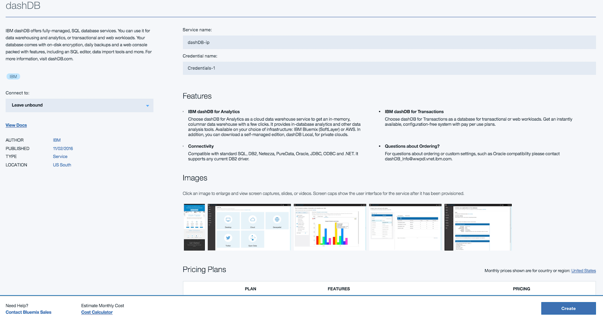
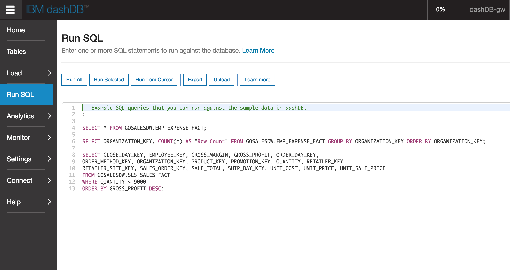
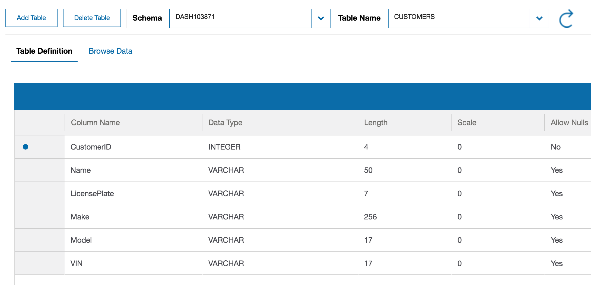
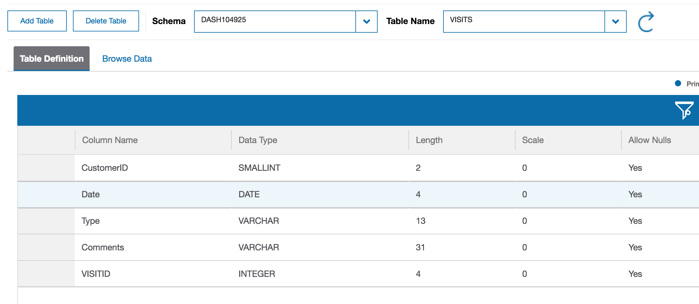
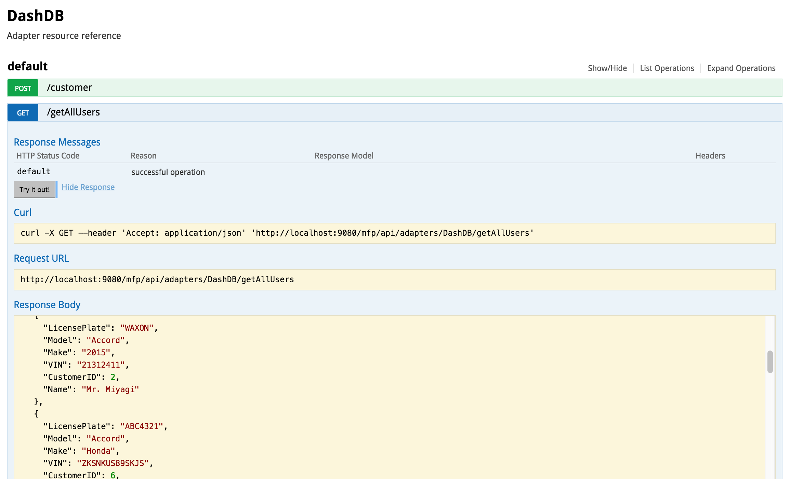

#  Mobile Foundation - DashDB Adapter

This lab will demonstrate how to create a DashDB java sql adapter to read information from a DashDB database.
DashDB is DB2 cloud database hosted on Bluemix.
By reading from DashDB instead of directly from the OnPrem CRM, you lower the load on the CRM and read your replicated data in DashDB.

## What you will learn on this guide

 - How to create a DashDB Service on Bluemix
 - How to create a DashDB adapter for Mobile Foundation
 - How to test this adapter

## Requirements of this guide

- [Mobile Foundation Setup](/Lab/Contents/MFP-Setup-Mobile-Foundation-on-Bluemix/Readme.md)

## Guide

### Instantiating the DashDB Service

1 - Instantiate the [DashDB Service](https://console.ng.bluemix.net/catalog/services/dashdb/) by clicking `Create`.


2 - In the Bluemix console, get your username and password from the location shown below.
You will need these later to configure your adapter.


3 - Open your DashDB console where you will see the following screen.


### Create Customer and Visit Tables

1 - To create the customer and visit tables, run the following sql commands "Run SQL" in the section show below.
```sql
CREATE TABLE CUSTOMERS (
 "CustomerID" INTEGER NOT NULL,
 "Name" VARCHAR(50),
 "LicensePlate" VARCHAR(7),
 "Make" VARCHAR(256),
 "Model" VARCHAR(17),
 "VIN" VARCHAR(17),
 PRIMARY KEY ("CustomerID")
);

CREATE TABLE VISITS (
 "CustomerID" SMALLINT,
 "Date" VARCHAR(30),
 "Type" VARCHAR(13),
 "Comments" VARCHAR(256),
 "VISITID" INTEGER
);
```

2 - Once finished you will see your tables in "Tables"





### Deploying the DashDB Adapter

1 - Build the adapter 
```bash
cd ../DashDBAdapter/
mfpdev adapter build
```
2 - Deploy the adapter in the console, by uploading the `DashDbAdapter.adapter` file.

3 - Set your username and password for your DashDB Adapter in the mfp console.
The database url is already set to the default url on bluemix.
> You can also set these credentials `MotoCorpService/Adapters/DashDBAdapter/src/main/adapter-resources` in your `adapter.xml`.


### DashDB Adapter - How it Works

In the `pom.xml` there's a dependency on a DB2 jar driver that is provided in the project.

```xml
<dependency>            
   <groupId>com.ibm.db2.jcc</groupId>
   <artifactId>db2jcc4</artifactId> 
   <version>1.0.1</version>
   <scope>system</scope>
   <systemPath>${project.basedir}/lib/db2jcc4.jar</systemPath>
</dependency>
```

In `JavaSqlApplication.java` add the DB2 driver name in the `init()` function.
```java
dataSource.setDriverClassName("com.ibm.db2.jcc.DB2Driver");
```

To execute a sql query to `getAllUsers` in the java adapter, you will need to do a couple of things.

1 - Create a JSONArray to store the response to return
```
JSONArray results = new JSONArray();
```

2 - Create a sql connection
```
Connection con = getSQLConnection();
```

3 - Create the sql query you will be using to query DashDB
```
PreparedStatement getAllUsers = con.prepareStatement("SELECT * FROM CUSTOMERS");
```

4 - The data ResultSet will hold the response from the sql query
```
ResultSet data = getAllUsers.executeQuery();
```

5 - Parse the data response and add it to your JSONArray

```
while(data.next()){
    JSONObject item = new JSONObject();
	item.put("CustomerID", data.getInt("CustomerID"));
	item.put("Name", data.getString("Name"));
	item.put("LicensePlate", data.getString("LicensePlate"));
	item.put("Make", data.getString("Make"));
	item.put("Model", data.getString("Model"));
	item.put("VIN", data.getString("VIN"));

	results.add(item);
}
```

6 - Close all your connections
```
getAllUsers.close();
con.close();
```

7 - Return your response
```
return Response.ok(results).build();
```

### Testing in Swagger

To test the adapter, go into Swagger. 
Select [GET] /getAllUsers and you will see all the data in your table.
Since your table does not have any data yet, you should see a 200 status with no response.
Below is an example of what the result would look like when there is data in your Customers table.




## Next guide

[NodeJS-CRM-OnPrem](/Lab/Contents/NodeJS-CRM-OnPrem/Readme.md)   
